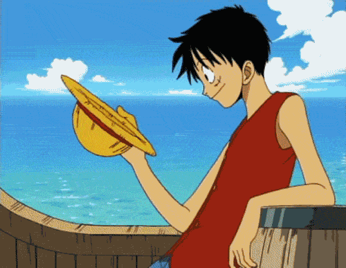

  

---

### 🎓 Formação Acadêmica

**Ensino Médio**  
🏫 SENAI - Jaraguá do Sul  
📚 Metodologia **STEAM** (Ciência, Tecnologia, Engenharia, Arte e Matemática)  
🔬🎨 Ciência e Arte combinadas para uma aprendizagem inovadora

---

### 😺 Aprendizagem & Experiência

**Curso:** Aprendizagem - Desenvolvimento de Sistemas (WEG)  
⏳ Duração: 2 anos

---
🌟 Tecnologias em uso atualmente

   
  
  
  
  
  
  
  
  

📊 GitHub Stats

<table>
  <tr>
    <td>
        
    </td>
    <td>
      
  

    </td>
  </tr>
</table>

 

  

