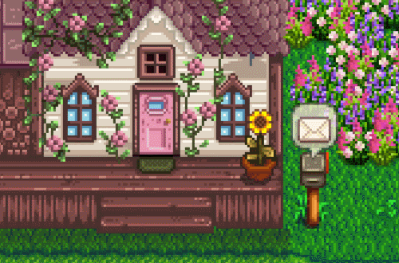

  
    
  
  
    
  

---

  
  

 

---

  Tecnologias utilizadas e em aprendizado 🌟
  
   
   
  

 
 

<table>
  <tr>
    <td>
      Projetos em Destaque 😁🌺
       
       
       
      WEG One 🔵: [Link](https://github.com/Liiiiisssz/WegOne)  
       
       
      SEO Agency 💻: [Link](https://github.com/melll1601/SEO-Agency)  
       
       
      WEG + Segura 🔰: [Link](https://github.com/andrMiotto/WEG-Segura-Sustentavel)
    </td>
    <td>
      
    </td>
  </tr>
</table>

 
 

---

 
 

  
  
  

  

